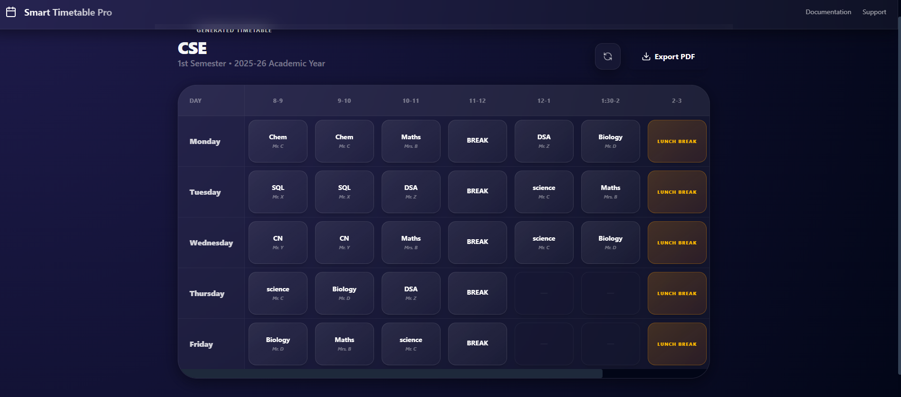
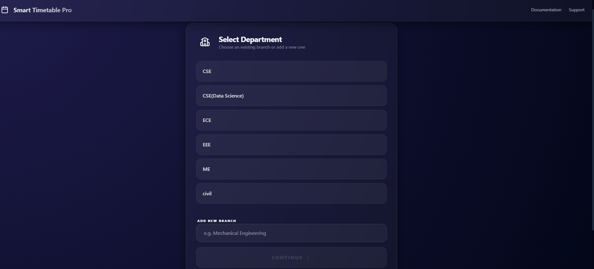
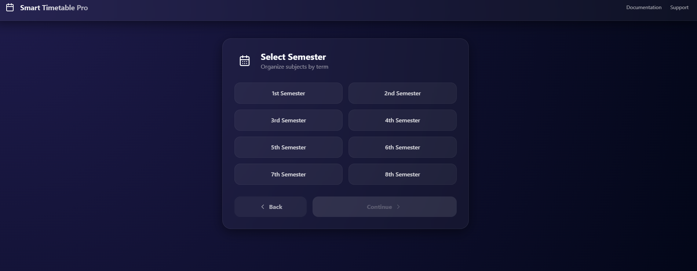
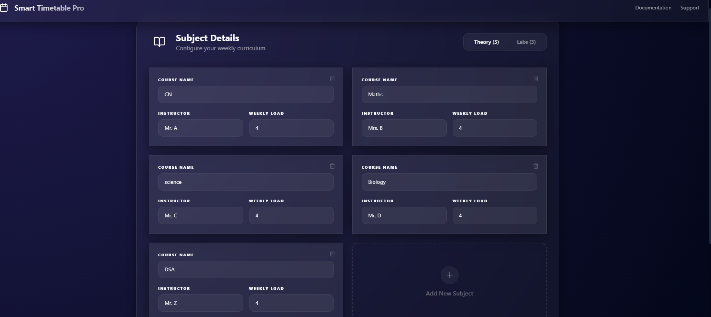
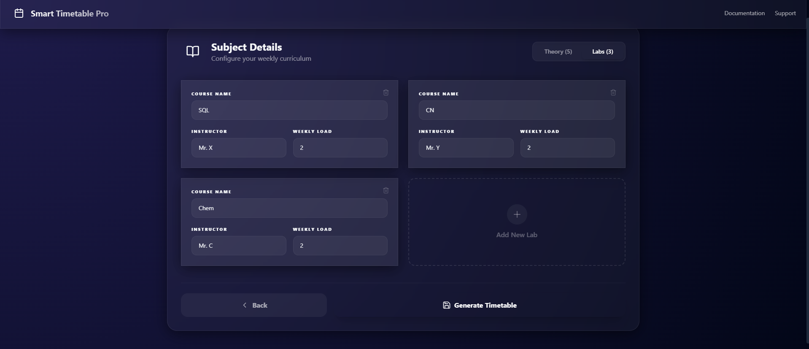

# 📅 Smart Timetable Generator

**Smart Timetable** is a high-performance, enterprise-grade scheduling application built to automate the complex task of academic planning. Featuring a stunning **Glassmorphism UI** and an intelligent balancing algorithm, it transforms hours of manual work into a single click.




## ✨ Key Features

-   **🤖 Intelligent Scheduling**: Advanced balancing logic that prevents class overcrowding and ensures an even distribution across the 5-day week (including Fridays!).
-   **💾 Persistent Data Retrieval**: Automatically remembers previously entered subjects for any Branch/Semester combination, saving users from repetitive data entry.
-   **🎨 Premium UI/UX**: A state-of-the-art interface built with **React**, **Tailwind CSS**, and **Framer Motion**, featuring smooth transitions and a vibrant dark mode.
-   **📄 Professional PDF Export**: Generate high-quality, landscape-oriented PDF timetables with custom branding and clear academic titles.
-   **⚙️ Branch Management**: Full CRUD capabilities to manage departments and semesters dynamically.
-   **☕ Optimized Breaks**: Built-in logic for 11:00 AM short breaks and 1:30 PM lunch periods.

## 🛠️ Technology Stack

### Frontend
-   **React 18** (Vite-powered for ultra-fast builds)
-   **Tailwind CSS** (Custom theme & Glassmorphism effects)
-   **Framer Motion** (Production-grade animations)
-   **Lucide React** (Consistent, high-quality iconography)
-   **Axios** (Robust API communication)

### Backend
-   **Django & DRF** (Scalable RESTful API)
-   **MongoEngine** (Document-Object Mapper for MongoDB)
-   **ReportLab** (Dynamic PDF generation)
-   **CORS Headers** (Secure cross-origin communication)

### Database
-   **MongoDB** (Flexible NoSQL storage for complex scheduling data)

## 📸 Interface Preview

| Step 1: Departments | Step 2: Semesters |
| :--- | :--- |
|  |  |

| Step 3: Theory Subjects | Step 4: Lab Subjects |
| :--- | :--- |
|  |  |

## 🚀 Getting Started

### Prerequisites
-   Node.js (v20+)
-   Python (v3.10+)
-   MongoDB (Running locally on port 27017)

### Backend Setup
1. Navigate to the root directory.
2. Install dependencies:
   ```bash
   pip install -r requirements.txt
   ```
3. Run the server:
   ```bash
   python manage.py runserver
   ```

### Frontend Setup
1. Navigate to the `frontend` directory.
2. Install dependencies:
   ```bash
   npm install
   ```
3. Run the development server:
   ```bash
   npm run dev
   ```

## 🧠 The Algorithm
The generator uses a custom-built iterative allocation strategy:
1.  **Lab Prioritization**: Allocates multi-hour lab sessions first to ensure consecutive slots.
2.  **Balancing Pass**: Distributes theory subjects day-by-day to maintain a target maximum class count per day.
3.  **Conflict Prevention**: Checks for adjacent duplicate subjects and ensures breaks remain sacred.

---

Built with ❤️ by [Your Name/GitHub Profile]
